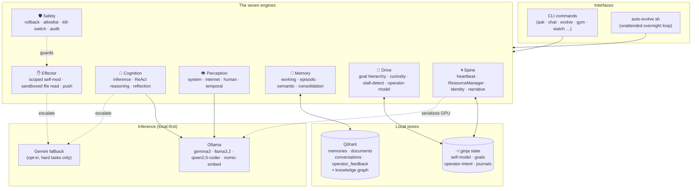
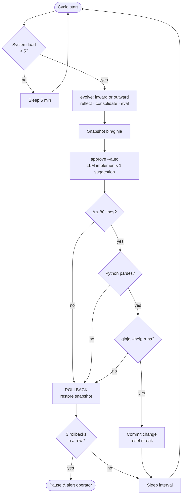

# ginja

**A self-evolving, local-first AI "second brain" for your terminal.**

ginja runs entirely on your own hardware — [Ollama](https://ollama.com) for inference, [Qdrant](https://qdrant.tech) for vector memory — with **zero cloud APIs required by default**. It is not just a RAG chatbot: it is an autonomous agent with a persistent identity that *grows itself over time* through supervised, rollback-guarded self-modification.

> Ask it questions, feed it your notes, and let it run an overnight **evolution loop** that deepens its self-model, learns new techniques, scores its own progress against a rubric, and even rewrites parts of its own source — all behind seven layers of safety checks.

---

## Table of contents

- [What makes ginja different](#what-makes-ginja-different)
- [Architecture](#architecture)
- [The autonomous evolution loop](#the-autonomous-evolution-loop)
- [Requirements](#requirements)
- [Install](#install)
- [Command reference](#command-reference)
- [Configuration](#configuration)
- [Safety model](#safety-model)
- [Project layout](#project-layout)
- [Roadmap](#roadmap)
- [License](#license)

---

## What makes ginja different

Most local-AI projects stop at "RAG over my notes." ginja adds an **autonomy spine** on top of that:

- **Persistent identity** — a `self-model` (mood, focus topic, phase, evolution count) that changes as the system runs and is reflected in a live ASCII portrait.
- **Self-directed growth** — `evolve` / `gym` cycles deepen the self-representation (*inward*) or pull in new techniques from the web (*outward*).
- **Supervised self-modification** — the brain proposes improvements to its own visualization code; an LLM implements them; the change is syntax-checked, runtime-checked, and **auto-rolled-back** if anything breaks.
- **Operator alignment** — your feedback (`react`) and a top-level `operator-intent` directive are weighted *above* the brain's own reflections, so it evolves toward what *you* want, not random drift.
- **Resource-aware** — a cross-process `ResourceManager` serializes GPU inference and tracks VRAM so it stays stable on a single 4 GB card.

Everything is FOSS-first, terminal-first, and private by default.

---

## Architecture

ginja is organized as **seven cooperating engines** sharing a Qdrant memory substrate. A single Python file (`bin/ginja`) exposes them as CLI commands; an overnight shell loop drives them autonomously.



**Engine map (where each lives in code):**

| Engine | Responsibilities | Key entry points |
| --- | --- | --- |
| **Memory** | Vector recall, doc ingestion, episodic→semantic compaction | `store_memory`, `search_memory`, `consolidate`, `_kg_*` |
| **Cognition** | One-shot answers, multi-step ReAct, self-reflection | `ask`, `_react_loop`, `reflect` |
| **Perception** | System/service probes, web search, temporal sense | `_perceive`, `_react_execute`, `search`, `today` |
| **Effector** | Scoped code self-mod, sandboxed file read | `approve`, `_implement_code_suggestion`, `_react_execute` |
| **Drive** | Goal stack, curiosity, stall detection, operator model | `_load_goals`, `_goal_stack_block`, `wonder`, `operator-intent` |
| **Safety** | Pre-backup, size cap, syntax/runtime gates, rollback streak | `auto-evolve.sh`, `_validate_and_write` |
| **Spine** | Evolution loop, GPU lock, identity, self-narrative | `gym`, `ResourceManager`, `self-model`, `story` |

---

## The autonomous evolution loop

The standout feature. `gym` (interactive) and `auto-evolve.sh` (unattended) run repeating cycles. Self-modification is **deliberately containment-scoped**: the LLM may only rewrite the `_make_watch_layout` visualization section — never the core logic — and every write passes through a gauntlet before it sticks.



Run it:

```bash
# interactive, stops cleanly on Ctrl+C
ginja gym --duration 2h --mode alternate

# unattended overnight, 30-min interval, runs until stopped
~/.ginja/auto-evolve.sh 0 30
```

---

## Requirements

- **[Ollama](https://ollama.com)** — local inference engine
- **[Qdrant](https://qdrant.tech)** — vector database (Docker is the easy path)
- **Python 3.10+**
- **GPU with ~4 GB+ VRAM** recommended (CPU works but is slow)
- **Optional:** a [SearXNG](https://searxng.org) instance for web search/research; a Gemini API key for the opt-in hard-task fallback

**Python dependencies** (a `requirements.txt` is not yet committed — see [Roadmap](#roadmap)):

```bash
pip install click rich ollama qdrant-client requests
```

---

## Install

> No `setup.sh` is committed on `master` yet. Manual install for now:

```bash
# 1. Clone
git clone https://github.com/MistaJoka/ginja-brain.git ~/ginja-brain
cd ~/ginja-brain

# 2. Install Python deps
pip install click rich ollama qdrant-client requests

# 3. Put ginja on your PATH
mkdir -p ~/bin && ln -sf ~/ginja-brain/bin/ginja ~/bin/ginja
chmod +x ~/bin/ginja
export PATH="$HOME/bin:$PATH"        # add to ~/.bashrc to persist

# 4. Start Qdrant (Docker)
docker run -d --name qdrant -p 6333:6333 \
  -v qdrant_storage:/qdrant/storage qdrant/qdrant

# 5. Pull models
ollama pull nomic-embed-text        # embeddings (required)
ollama pull llama3.2:3b             # fast
ollama pull gemma3:4b               # primary
ollama pull qwen2.5-coder:3b        # code

# 6. Seed config & verify
cp .ginja/config.example.json ~/.ginja/config.json   # then edit as needed
ginja status
```

---

## Command reference

ginja exposes ~30 subcommands. Run `ginja --help` for the live list.

### Core

| Command | What it does |
| --- | --- |
| `ginja ask "<q>"` | Stream an answer with RAG context; saves to memory. `--fast` `--quality` `--model` `--no-memory` |
| `ginja chat` | Interactive multi-turn session with full memory context |
| `ginja status` | Health check across Ollama, Qdrant, collections, config |

### Memory

| Command | What it does |
| --- | --- |
| `ginja remember "<fact>"` | Save a fact to persistent memory |
| `ginja recall "<q>"` | Semantic search over memory. `--top N` |
| `ginja ingest <path>` | Ingest a file/dir (recursive) as documents. `--chunk-size` `--overlap` `--ext` |
| `ginja memories` | Per-collection stats, age, and health |
| `ginja forget "<kw>"` | Remove memories matching a keyword (confirms first). `--force` |
| `ginja prune` | Drop old/duplicate entries. `--days` `--collection` `--dedup` `--threshold` |
| `ginja consolidate` | Compress episodic perception logs into semantic memory. `--days` `--force` |

### Research & web

| Command | What it does |
| --- | --- |
| `ginja search "<q>"` | Web search via SearXNG. `--results` `--ingest` |
| `ginja research "<topic>"` | Multi-query research; snippets by default. `--depth` `--pages` `--fetch` |

### Autonomy

| Command | What it does |
| --- | --- |
| `ginja evolve` | Grow inward (deepen self-model). `--learn` looks outward for techniques |
| `ginja gym` | Run evolution in a loop. `--duration` `--cycles` `--rest` `--mode` |
| `ginja reflect` | Inward self-assessment. `--store` persists it |
| `ginja approve` | Curate & approve the suggestion queue. `--auto` `--code-cap` `--list` `--no-curate` |
| `ginja eval` | Score recent evolution quality against the rubric |
| `ginja react "<feedback>"` | Send operator feedback, weighted above self-reflection |

### Introspection

| Command | What it does |
| --- | --- |
| `ginja watch` | Live ASCII visualization of the brain "thinking." `--refresh` |
| `ginja today` | Morning brief |
| `ginja story` | Temporal self-narrative — who ginja has become. `--regen` |
| `ginja wonder` | Things ginja found genuinely surprising or beautiful |
| `ginja journal` | Render evolution journal entries. `--last` |
| `ginja evolution-log` | What ginja has learned autonomously. `--all` |
| `ginja suggest-visuals` | Brain critiques its own display and queues improvements |

### Resources & diagnostics

| Command | What it does |
| --- | --- |
| `ginja resources` | VRAM/RAM, loaded models, inference lock. `--evict <model>` `--evict-all` |
| `ginja test-gemini` | Verify the Gemini fallback key and list models |

---

## Configuration

Config lives at `~/.ginja/config.json`. Seed it from `.ginja/config.example.json`:

```json
{
  "primary_model": "gemma3:4b",
  "code_model": "qwen2.5-coder:3b",
  "fast_model": "llama3.2:3b",
  "quality_model": "qwen2.5:7b",
  "embed_model": "nomic-embed-text",
  "ollama_url": "http://localhost:11434",
  "qdrant_url": "http://localhost:6333",
  "searxng_url": "http://localhost:8080",
  "gemini_api_key": "YOUR_GEMINI_API_KEY_HERE",
  "gemini_model": "gemini-2.5-flash",
  "use_gemini_fallback": false,
  "gemini_for_evolve": true,
  "gemini_for_implement": false,
  "top_k_memories": 5,
  "num_ctx": 4096
}
```

**Persona:** the system prompt injected into every call lives at `~/.ginja/persona.md` and is yours to edit. **Operator intent:** the top-level directive steering evolution lives at `~/.ginja/operator-intent.json`.

---

## Safety model

ginja modifies its own code, so safety is treated as a first-class engine, not an afterthought:

- **Containment** — the LLM may only rewrite the `_make_watch_layout` visualization section, located by markers. Core logic is off-limits by construction.
- **Pre-write validation** — every candidate is `py_compile`-checked in a temp file before it ever touches the real source.
- **Snapshot + rollback** — `auto-evolve.sh` backs up `bin/ginja` before each cycle and restores it on any failure.
- **Change-size cap** — edits larger than ±80 lines are treated as catastrophic and rolled back.
- **Runtime gate** — after a write, `ginja --help` must still run (catches import-time breakage).
- **Streak breaker** — three consecutive rollbacks pause the loop and alert the operator.
- **Resource lock** — `ResourceManager` uses `fcntl` advisory locking so concurrent inference can't OOM the GPU; the OS releases the lock if a process dies.

---

## Project layout

```
ginja-brain/
├── bin/
│   └── ginja              # the entire agent (single Python file)
├── .ginja/                # runtime state + automation scripts
│   ├── auto-evolve.sh     # hardened unattended evolution loop
│   ├── config.example.json
│   ├── persona.md         # system-prompt identity (edit yours)
│   ├── operator-intent.json
│   ├── self-model.json    # live identity state
│   ├── goals.json / goal-stack.json
│   ├── rubric.json        # evolution-quality scoring
│   └── …                  # journals, histories, RSS/ingest helpers
└── README.md
```

> **Note:** runtime state files under `.ginja/` are currently tracked in git. These are intended to be machine-local — see [Roadmap](#roadmap) for the planned `.gitignore` + template split.

---

## Roadmap

- [ ] Move runtime state out of version control; ship `*.example` templates only (`self-model`, `goals`, `operator-intent`, `persona`)
- [ ] Commit a real `requirements.txt` and `setup.sh`
- [ ] Extract the watch-layout into its own module so self-mod targets a small, reviewable file instead of marker-matching a 5k-line monolith
- [ ] Smoke tests for the safety rails (oversized-delta, syntax-error, runtime-failure → rollback)
- [ ] Add a `LICENSE`

---

## License

Not yet set. **MIT** recommended for a FOSS-first project — add a `LICENSE` file before sharing widely.

---

<sub>Built by [Andrae Williams](https://github.com/MistaJoka) — a local, private, self-evolving AI that runs on hardware you own.</sub>
